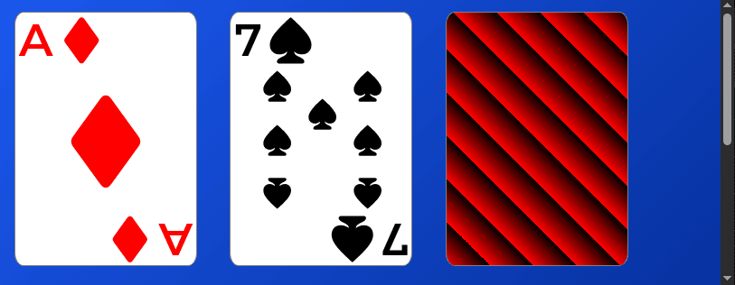

#+title: Playing Card
#+date: <2026-05-14 Thu>
#+author: Richard Frangie
#+language: en

#+html: 
#+html: 
#+html: 
#+html: 
#+html:   

This project explores how to build a reusable playing-card with Web Components. It's based on the [[https://github.com/richardfrangie/52-card-deck][Standard 52-Card Deck]] project, and focuses on component structure, styling, and layout techniques that can later be reused in a solitaire game.

* Demo
[[https://richardfrangie.github.io/playing-card/][Live demo →]]

* What it covers
- Built wih HTML, CSS & JS
- Uses Web Components (Custom Elements, Shadow DOM)
- Responsive card layout
- Flexbox and CSS Grid for layout
- Positioning and stacking contexts

* Installation/Setup

* Usage
Use it like any other HTML element with the tag name ~playing-card~. It accepts two attributes and one optional class.

The card size can be controlled with the custom property ~--card-width~.

#+begin_src css

  body {
  --card-width: 200px;  /* fixed size */
  /* or  */
  --card-width: 10vw;   /* responsive size */
  }

#+end_src

** Attributes:
- ~suit~: sets the type of card. Valid values are ~diamond~, ~spade~, ~heart~, ~club~
- ~rank~: sets the number of the card. Valid values range from ~1~ to ~13~
- ~flipped~: turns the card over. Boolean attribute

** Example of use

#+begin_src html

  <!-- Diamond ace -->
  <playing-card suit="diamond" rank="1"></playing-card>

  <!-- Flipped card -->
  <playing-card suit="club" rank="13" flipped></playing-card>

#+end_src

* Status
- Verified on Chromium and Firefox

* References
- [[https://github.com/richardfrangie/52-card-deck][Standard 52-Card Deck]]
- [[https://www.youtube.com/watch?v=_lGwyHDcKIc&t=10464s][ManzDev:  🃏 Grid + Flexbox: Creando cartas de poker con código CSS (y componentes)]]
